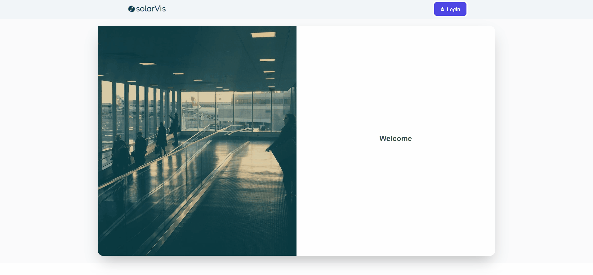

## ReactJs - No Code Lead Generation

## Objective

- This is a no-code Lead Generation tool built with React. The application serves as an interactive platform for admins to create dynamic pages and generate leads according to custom configurations. This project was an assignment task that challenged me to utilize my React skills to create a robust tool that includes an admin login, an admin configuration page to set the variables, and a lead generation page rendered based on the admin's configuration.

- Throughout this project, I have showcased my ability to handle frontend development using React, external state management libraries like Redux. The result is a versatile, user-friendly tool that can be adapted to a range of lead generation scenarios.

## Features

### Admin Login

Admins can log in using a valid email and password. Validation checks are included to prevent invalid access. On successful login, the admin is redirected to the configuration page.

```
Valid Email: solarvis@gmail.com
Valid Password: solarvis123
```

### Admin Configuration Page

On this page, authenticated admins can define various configurations for the lead generation page. The configurations include the number of input/output pages, their titles, descriptions, input variables, and their types. Admins can also set a calculation formula using the configured input variables, and define output values and units. Additionally, the admin has the flexibility to turn on/off the contact page and define what inputs appear on it.

### Lead Generation Page

This page is dynamically rendered based on the configuration set by the admin. The lead generation process involves traversing through the input pages by clicking on the "Next" and "Back" buttons. The results of the calculations are presented on the output pages along with any other relevant information as configured by the admin.

## Project Link

#### You can reach my project from [here](https://reactjs-no-code-lead-generation.vercel.app/) 👈

## Project Skeleton

```
fs-reactjs-blog-app  (folder)
|----readme.md
SOLUTION
├── public
│    └── index.html
├── src
│    ├── app
│    │       └── store.jsx
│    ├── assets
│    │       └── [images]
│    ├── components
│    │       ├─── adminPages
│    │       │      ├── InputPage.jsx
│    │       │      └── OutputPage.jsx
│    │       ├─── formPages
│    │       │      ├── ContactPage.js
│    │       │      ├── InputPage.js
│    │       │      ├── OutputPage.js
│    │       │      └── ProgressBar.js
│    │       │
│    │       ├── Navbar.jsx
│    │       └── Footer.jsx
│    ├── Features
│    │       ├── authSlice.jsx
│    │       └── configSlice.jsx
│    ├── helpers
│    │       ├── customHooks.js
│    │       ├── customToastify.js
│    │       └── svg.js
│    ├── pages
│    │       ├── Admin.js
│    │       ├── Home.js
│    │       ├── Login.js
│    │       └── Register.jsx
│    ├── router
│    │       └── AppRouter.jsx
│    ├── App.js
│    ├── App.css
│    └── index.js
├── .gitignore
├── package-lock.json
├── package.json
├── postcss.config.js
├── tailwind.config.js
└── yarn.lock
```

### At the end of the project, following topics are to be covered;

- HTML
- CSS
- JavaScript
- ReactJS
- Redux Toolkit
- React Router DOM
- Tailwind CSS
- Toastify

To run this project;

```
$ git clone https://github.com/esadakman/reactjs-no-code-lead-generation
$ cd ./reactjs-no-code-lead-generation
$ npm install / yarn
$ npm start / yarn start
```

### Preview of the Project

